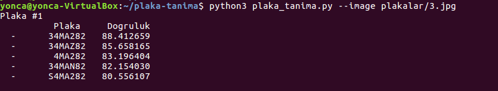

# plaka-tanima
OpenALPR ile plaka tanima ornegi


### Yuklememiz Gerekenler

```language-bash

sudo apt-get update && sudo apt-get install -y openalpr openalpr-daemon openalpr-utils libopenalpr-dev

```

### Python Paketlerini Yukleme


```language-bash

pip3 install -r requirements.txt

# dev paketi icin (ipdb)

pip3 install -r requirements-dev.txt

```

### Program Kullanimi

```language-bash

python3 plaka_tanima.py --image <IMAGE_PATH>

```


### Ornek 


